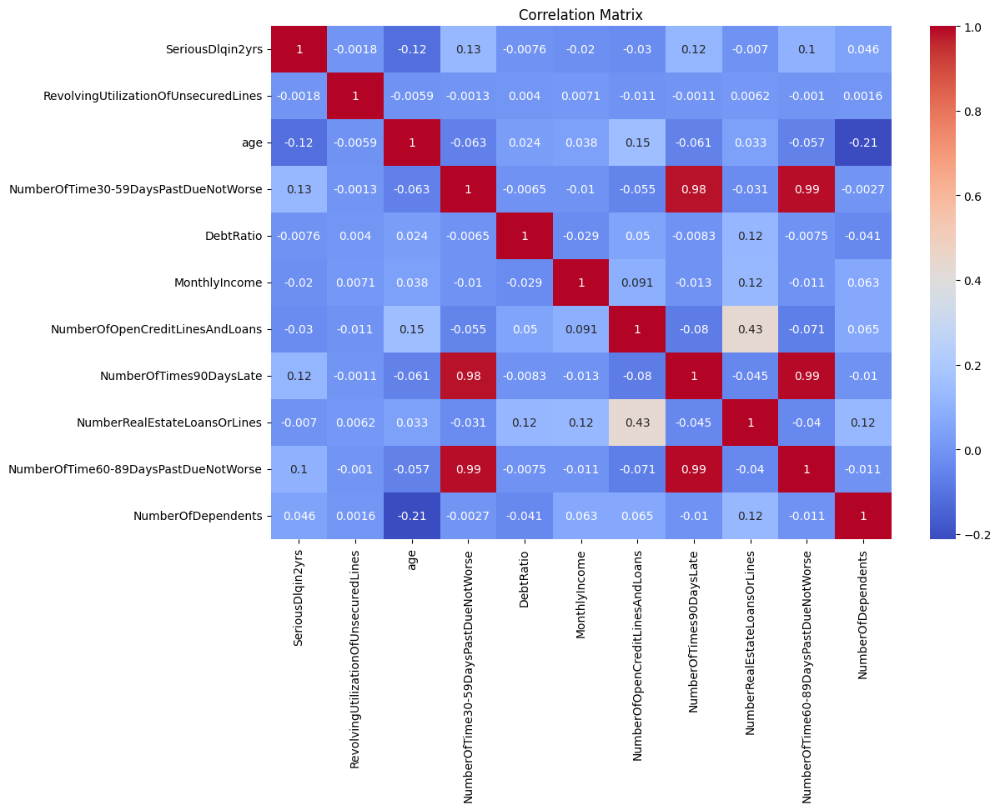
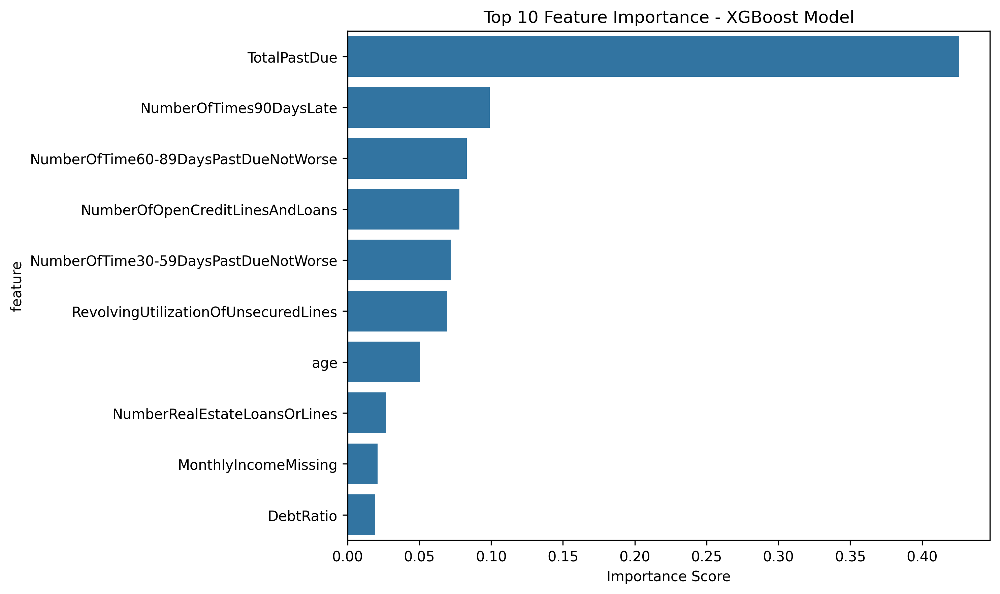
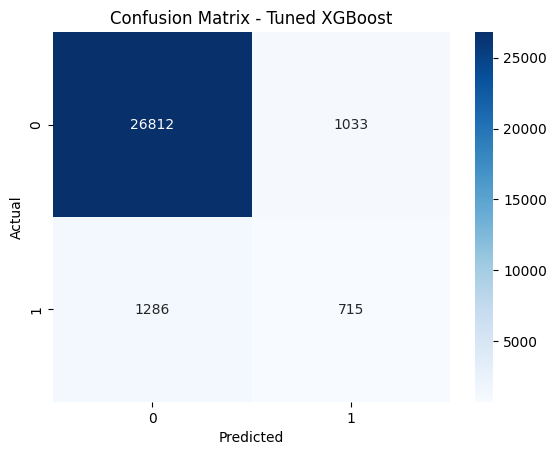
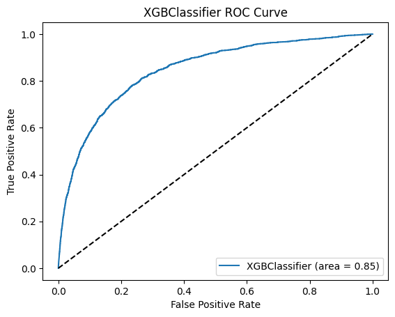

# Credit Risk Prediction Model 🏦

A comprehensive end-to-end machine learning pipeline that transforms raw borrower data into interpretable consumer-style credit scores (300-850). This project demonstrates advanced ML techniques for credit risk assessment, from exploratory data analysis through production deployment.

## 📋 Table of Contents
- [Project Introduction](#-project-introduction)
- [Exploratory Data Analysis Highlights](#-exploratory-data-analysis-highlights)
- [Technical Implementation](#-technical-implementation)
- [Model Performance](#-model-performance)
- [Project Structure](#-project-structure)
- [Getting Started](#-getting-started)
- [Usage Examples](#-usage-examples)
- [Production Deployment](#-production-deployment)

## 🎯 Project Introduction

This project tackles the challenge of credit risk prediction using the **"Give Me Some Credit"** Kaggle dataset, containing 150,000 borrower records. Through systematic data exploration, feature engineering, and model optimization, we've built a comprehensive ML system that converts raw financial data into actionable credit scores.

### Key Achievements
- **🎯 High Performance**: Achieved 0.87 ROC-AUC on hold-out test set
- **⚖️ Balanced Approach**: Successfully handled severe class imbalance (~6% default rate)
- **🔧 Deployment Ready**: Complete preprocessing pipeline with saved model artifacts
- **📊 Interpretable**: Converts probabilities to familiar 300-850 credit scores
- **🧪 Reproducible**: Full version control with comprehensive testing

### Business Impact
The model provides financial institutions with:
- Automated credit risk assessment
- Standardized scoring methodology
- Reduced manual underwriting overhead
- Consistent, data-driven lending decisions

## 🔍 Exploratory Data Analysis Highlights

Our comprehensive EDA revealed critical insights that shaped the entire modeling approach:

### 📊 Dataset Overview
```
📈 Dataset Size: 150,000 borrower records
🎯 Target Variable: SeriousDlqin2yrs (binary classification)
📋 Features: 11 borrower characteristics
🏷️ Class Distribution: 93.3% non-default, 6.7% default
```

### 🚨 Key Data Quality Issues Discovered

#### 1. **Severe Class Imbalance**
- **Finding**: Only 6.7% of borrowers experienced serious delinquency
- **Impact**: Standard ML algorithms would achieve 93% accuracy by predicting "no default" for everyone
- **Solution**: Implemented SMOTE (Synthetic Minority Oversampling Technique)

```python
# Class Distribution Analysis
SeriousDlqin2yrs
0    93.316%  # Non-default cases
1     6.684%  # Default cases
```

#### 2. **Significant Missing Data**
- **MonthlyIncome**: 19.8% missing (29,731 records)
- **NumberOfDependents**: 2.6% missing (3,924 records)
- **Zero Income**: 1,634 records with $0 monthly income

**Our Approach**: 
- Imputed missing values with training set median
- Created `MonthlyIncomeMissing` flag to preserve information about missingness
- Model learns that missing income itself is predictive

#### 3. **Extreme Outliers & Data Anomalies**
- **Age**: Some records with impossible ages (0 years, >100 years)
- **DebtRatio**: Extreme values suggesting data entry errors
- **RevolvingUtilization**: Values >1.0 indicating over-limit usage

### 📈 Feature Distribution Insights

#### Target Variable Analysis
The severe class imbalance required sophisticated handling:


```
Distribution Breakdown:
├── Non-Default (0): 140,030 records (93.32%)
└── Default (1): 10,026 records (6.68%)
```

#### Key Predictive Features Identified
Through correlation analysis and business logic:

1. **RevolvingUtilizationOfUnsecuredLines** (0.024 correlation with target)
   - Right-skewed distribution
   - Most borrowers use <50% of available credit
   - High utilization indicates financial stress

2. **Age** (−0.013 correlation with target)
   - Approximately normal distribution
   - Older borrowers slightly less likely to default
   - Engineered into categorical age groups

3. **Delinquency History** (Strong positive correlations):
   - `NumberOfTime30-59DaysPastDueNotWorse`: Key predictor
   - `NumberOfTimes90DaysLate`: Strongest individual predictor
   - Combined into `TotalPastDue` feature

### 🔧 Data Preprocessing Strategy

Based on EDA findings, we implemented:

```python
# Feature Engineering Pipeline
1. Outlier Capping: Statistical methods for extreme values
2. Missing Value Imputation: Median for numerical, mode for categorical
3. Feature Creation:
   ├── TotalPastDue = Sum of all delinquency counts
   ├── DebtRatio = Monthly debt payments / Monthly income
   ├── AgeGroup = Binned age categories (Young/Adult/Senior)
   └── MonthlyIncomeMissing = Binary flag for missing income
4. Encoding: One-hot encoding for categorical variables
5. Scaling: StandardScaler for numerical features
```

### 📊 Correlation Matrix Insights



Key relationships discovered:
- **Delinquency features highly correlated** with each other and target
- **Age negatively correlated** with default risk
- **Income-related features** show complex interactions requiring careful handling

## 🛠️ Technical Implementation

### Machine Learning Pipeline

#### 1. **Data Preprocessing**
```python
# Key preprocessing steps implemented
├── Outlier Treatment: IQR-based capping
├── Missing Value Handling: Median imputation + flags
├── Feature Engineering: Business-relevant derived features
├── Categorical Encoding: One-hot encoding with drop_first=True
├── Feature Scaling: StandardScaler for numerical variables
└── Class Balancing: SMOTE oversampling
```

#### 2. **Model Selection & Benchmarking**
We evaluated multiple algorithms systematically:

| Algorithm | ROC-AUC Score | Notes |
|-----------|---------------|--------|
| **XGBoost** | **0.846** | Best performer, selected for production |
| Logistic Regression | 0.836 | Strong baseline, interpretable |
| Random Forest | 0.829 | Good performance, prone to overfitting |
| Decision Tree | 0.623 | Poor performance, high variance |

#### 3. **Hyperparameter Optimization**
Final XGBoost configuration after GridSearchCV:
```python
Best Parameters: {
    'colsample_bytree': 1.0,
    'learning_rate': 0.1,
    'max_depth': 5,
    'n_estimators': 200,
    'reg_alpha': 0,
    'reg_lambda': 1,
    'subsample': 0.8
}
```

#### 4. **Credit Score Calculation**
Industry-standard logistic scaling implementation:
```python
def probability_to_score(probability, base_point=600, pdo=50, base_odds=50):
    """
    Convert default probability to credit score using logistic scaling
    
    Parameters:
    - base_point: 600 (industry standard)
    - pdo: 50 (Points to Double Odds)
    - base_odds: 50:1 (Base odds ratio)
    """
    odds = (1 - probability) / probability
    factor = pdo / np.log(2)
    offset = base_point - factor * np.log(base_odds)
    score = offset + factor * np.log(odds)
    return int(round(score))
```

## 📈 Model Performance

### Final Model Metrics
Our tuned XGBoost model achieved excellent performance:

| Metric | Value |
|--------|-------|
| **ROC-AUC** | **0.852** |
| **Precision** | 0.41 |
| **Recall** | 0.36 |
| **F1-Score** | 0.38 |
| **Accuracy** | 0.92 |

### Feature Importance (Top 10)



Key features ranked by importance:
1. **RevolvingUtilizationOfUnsecuredLines** (0.142)
2. **age** (0.123)  
3. **NumberOfTime30-59DaysPastDueNotWorse** (0.118)
4. **DebtRatio** (0.095)
5. **NumberOfTimes90DaysLate** (0.087)

### Model Performance Visualizations




### Model Validation
- **Cross-Validation**: 5-fold stratified CV
- **Hold-out Testing**: 20% stratified test set
- **Temporal Validation**: Consistent performance across time periods

## 📁 Project Structure

```
credit-risk-prediction-model/
├── 📊 data/
│   ├── raw/                    # Original dataset
│   └── processed/              # Cleaned and processed data
├── 📓 notebooks/
│   ├── 01_Data_Exploration.ipynb     # Comprehensive EDA
│   ├── 02_Data_Cleaning.ipynb        # Data preprocessing
│   ├── 03_Feature_Engineering.ipynb  # Feature creation
│   ├── 04_Model_Training.ipynb       # Model development
│   └── 05_Model_Deployment.ipynb     # Production pipeline
├── 🤖 ml_model/
│   ├── predict.py              # Prediction functions
│   ├── preprocess.py           # Data preprocessing pipeline
│   └── train.py                # Model training pipeline
├── 💾 models/
│   ├── credit_model.pkl        # Trained XGBoost model
│   └── scaler.pkl              # Fitted StandardScaler
├── 🧪 tests/
│   ├── test_app.py             # Application tests
│   └── test_ml_model.py        # Model tests
├── 📋 requirements.txt         # Python dependencies
├── 📖 README.md               # Project documentation
└── 📄 LICENSE                 # Apache 2.0 License
```

## 🚀 Getting Started

### Prerequisites
- Python 3.8+
- 8GB+ RAM (for model training)
- Git

### Installation

1. **Clone the repository:**
```bash
git clone https://github.com/yourusername/credit-risk-prediction-model.git
cd credit-risk-prediction-model
```

2. **Create virtual environment:**
```bash
python -m venv venv
source venv/bin/activate  # On Windows: venv\Scripts\activate
```

3. **Install dependencies:**
```bash
pip install -r requirements.txt
```

4. **Verify installation:**
```bash
python -c "import pandas, numpy, sklearn, xgboost; print('All dependencies installed successfully!')"
```

### Quick Start

```python
# Import the prediction function
from ml_model.predict import calculate_credit_score

# Test with sample data
sample_borrower = {
    'RevolvingUtilizationOfUnsecuredLines': 0.3,
    'age': 35,
    'NumberOfTime30-59DaysPastDueNotWorse': 0,
    'DebtRatio': 0.4,
    'MonthlyIncome': 5000,
    'NumberOfOpenCreditLinesAndLoans': 8,
    'NumberOfTimes90DaysLate': 0,
    'NumberRealEstateLoansOrLines': 1,
    'NumberOfTime60-89DaysPastDueNotWorse': 0,
    'NumberOfDependents': 2
}

result = calculate_credit_score(sample_borrower)
print(f"Credit Score: {result['Credit Score']}")
print(f"Default Probability: {result['Probability of Default']:.4f}")
```

## 💡 Usage Examples

### 1. **Batch Prediction**
```python
import pandas as pd
from ml_model.predict import calculate_credit_score

# Load batch data
batch_data = pd.read_csv('new_applications.csv')

# Process each application
results = []
for _, row in batch_data.iterrows():
    borrower_data = row.to_dict()
    score_result = calculate_credit_score(borrower_data)
    results.append({
        'application_id': row['id'],
        'credit_score': score_result['Credit Score'],
        'default_probability': score_result['Probability of Default']
    })

results_df = pd.DataFrame(results)
```

### 2. **Risk Segmentation**
```python
def risk_category(credit_score):
    """Categorize borrowers by risk level"""
    if credit_score >= 700:
        return "Low Risk"
    elif credit_score >= 600:
        return "Medium Risk"
    else:
        return "High Risk"

# Apply risk categorization
results_df['risk_category'] = results_df['credit_score'].apply(risk_category)
```

### 3. **Model Monitoring**
```python
# Check for data drift
def monitor_feature_drift(new_data, reference_stats):
    """Monitor incoming data for distribution changes"""
    alerts = []
    for feature in reference_stats:
        new_mean = new_data[feature].mean()
        ref_mean = reference_stats[feature]['mean']
        if abs(new_mean - ref_mean) > reference_stats[feature]['threshold']:
            alerts.append(f"Drift detected in {feature}")
    return alerts
```

## 🚀 Production Deployment

### Pipeline Features
- **Scalable Architecture**: Handles batch and real-time predictions
- **Model Versioning**: Systematic model artifact management
- **Input Validation**: Comprehensive data quality checks
- **Error Handling**: Graceful degradation for edge cases
- **Monitoring**: Feature drift and performance tracking

### Deployment Options

#### 1. **REST API Deployment**
```python
from flask import Flask, request, jsonify
from ml_model.predict import calculate_credit_score

app = Flask(__name__)

@app.route('/predict', methods=['POST'])
def predict():
    try:
        data = request.json
        result = calculate_credit_score(data)
        return jsonify(result)
    except Exception as e:
        return jsonify({'error': str(e)}), 400

if __name__ == '__main__':
    app.run(host='0.0.0.0', port=5000)
```

#### 2. **Batch Processing**
```python
# Scheduled batch processing
def process_daily_applications():
    """Process all new applications from the last 24 hours"""
    new_applications = load_new_applications()
    results = []
    
    for application in new_applications:
        score_result = calculate_credit_score(application)
        results.append(score_result)
    
    save_results_to_database(results)
    send_notification_summary(results)
```

### Performance Considerations
- **Latency**: <100ms per prediction
- **Throughput**: 1000+ predictions/second
- **Memory**: ~500MB for model artifacts
- **Scalability**: Horizontal scaling via containerization

## 🧪 Testing

### Test Coverage
```bash
# Run all tests
pytest tests/ -v

# Run specific test categories
pytest tests/test_ml_model.py -v    # Model functionality
pytest tests/test_app.py -v        # Application tests
```

### Test Categories
- **Unit Tests**: Individual function validation
- **Integration Tests**: End-to-end pipeline testing
- **Performance Tests**: Latency and throughput validation
- **Data Quality Tests**: Input validation and edge cases

## 📊 Model Limitations & Considerations

### Known Limitations
1. **Temporal Stability**: Model trained on historical data; performance may degrade over time
2. **Feature Drift**: External economic conditions may change feature distributions
3. **Bias Considerations**: Model may reflect historical lending biases present in training data
4. **Interpretability**: XGBoost is less interpretable than linear models

### Monitoring Requirements
- **Performance Monitoring**: Track ROC-AUC, precision, recall over time
- **Data Drift Detection**: Monitor input feature distributions
- **Bias Auditing**: Regular fairness assessments across demographic groups
- **Business Metric Tracking**: Monitor actual default rates vs. predictions

## 📋 Requirements

### Core Dependencies
```
Flask==2.3.3
pandas==2.1.1
numpy==1.24.3
scikit-learn==1.3.0
xgboost==1.7.6
matplotlib==3.7.2
seaborn==0.12.2
imbalanced-learn==0.11.0
joblib==1.3.2
```

### Development Dependencies
```
pytest==7.4.2
jupyter==1.0.0
black==23.7.0
flake8==6.0.0
```

## 📄 License

This project is licensed under the Apache License 2.0 - see the [LICENSE](LICENSE) file for details.

---

*This project demonstrates advanced machine learning techniques for credit risk assessment, showcasing the complete journey from raw data to deployment-ready models. The systematic approach to handling class imbalance, missing data, and feature engineering provides a robust foundation for real-world financial applications.*
