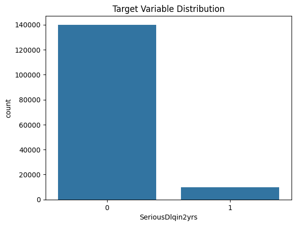
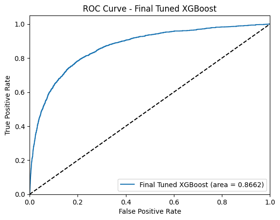
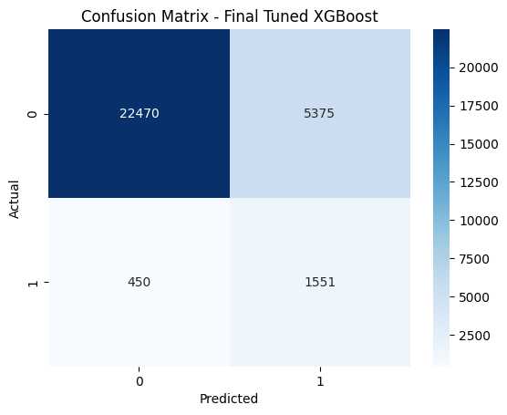
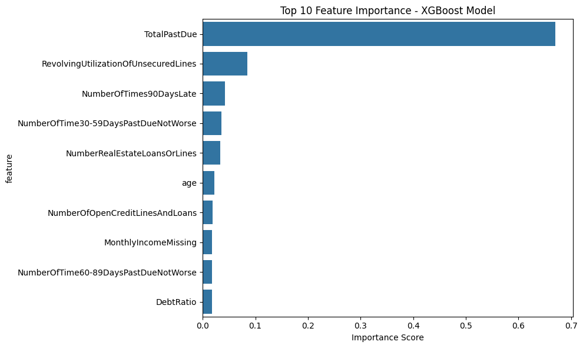

# Credit Risk Prediction Model 🏦

This project develops a robust machine learning model for credit risk assessment, transforming raw borrower data into predictive insights and consumer-style credit scores (300-850). It demonstrates a systematic approach to building and optimizing a high-performing classification model using the "Give Me Some Credit" Kaggle dataset (150,000 records). The focus is on the rigorous development of the predictive model, from data analysis to final evaluation, making it a strong showcase of applied machine learning skills for quantitative and technical roles.

## 📋 Table of Contents
- [Project Objective](#-project-objective)
- [Key Achievements](#-key-achievements)
- [Methodology Overview](#-methodology-overview)
  - [1. Exploratory Data Analysis (EDA)](#1-exploratory-data-analysis-eda)
  - [2. Data Cleaning & Preprocessing](#2-data-cleaning--preprocessing)
  - [3. Feature Engineering](#3-feature-engineering)
  - [4. Model Development & Optimization](#4-model-development--optimization)
- [Final Model Performance](#-final-model-performance)
- [Project Structure](#-project-structure)
- [Getting Started](#-getting-started)
- [Usage Example](#-usage-example)

## 🎯 Project Objective

To develop a high-performing binary classification model that accurately predicts the likelihood of a borrower experiencing serious delinquency within two years. The model's output (probability of default) is then converted into an easily interpretable credit score. This project emphasizes a data-driven approach to financial risk modeling, crucial in fin-tech and quantitative finance.

## 🏆 Key Achievements

*   **High Predictive Accuracy**: Achieved a **Test ROC AUC of 0.8662**, demonstrating strong discrimination between defaulting and non-defaulting borrowers.
*   **Effective Imbalance Handling**: Successfully managed a severe class imbalance (6.7% default rate) using XGBoost's `scale_pos_weight` parameter, resulting in **78% recall** for the crucial default class. This shows a practical approach to real-world skewed datasets.
*   **Rigorous Modeling Process**: Systematic EDA, robust data cleaning, impactful feature engineering (e.g., `TotalPastDue`), and meticulous hyperparameter tuning (GridSearchCV).
*   **Quantifiable Impact**: The model can identify nearly 4 out of 5 actual defaulters, a significant improvement for risk mitigation strategies.
*   **Reproducible & Documented**: The entire workflow is documented across Jupyter notebooks, ensuring clarity and reproducibility. Model artifacts (trained model and scaler) are saved for use.
*   **Practical Application Insight**: Includes conversion of default probabilities to industry-standard credit scores (300-850 range), showcasing an understanding of real-world deployment considerations.

## 🛠️ Methodology Overview

The project follows a structured machine learning pipeline:

### 1. Exploratory Data Analysis (EDA)
*   **Dataset**: [Give Me Some Credit](https://www.kaggle.com/c/give-me-some-credit/data) Kaggle competition (150,000 records, 11 features).
*   **Key Findings**:
    *   **Class Imbalance**: Target variable `SeriousDlqin2yrs` highly imbalanced (6.7% defaults). *(See distribution below)*
    *   **Missing Data**: Significant missingness in `MonthlyIncome` (19.8%) and `NumberOfDependents` (2.6%).
    *   **Outliers & Anomalies**: Identified in `age`, `DebtRatio`, and `RevolvingUtilizationOfUnsecuredLines`.
*   *Detailed analysis in `notebooks/01_Data_Exploration.ipynb`.*

<p align="center">
  
</p>

### 2. Data Cleaning & Preprocessing
*   **Outlier Treatment**: Capped extreme values for `DebtRatio` (99th percentile) and `RevolvingUtilizationOfUnsecuredLines` (at 10). Filtered invalid `age` entries.
*   **Missing Value Imputation**:
    *   `NumberOfDependents`: Imputed with 0.
    *   `MonthlyIncome`: Imputed with 0, and a binary flag `MonthlyIncomeMissing` was created to capture the information content of missingness.
*   **Data Type Correction**: Ensured appropriate data types for all features.
*   *Implementation details in `notebooks/02_Data_Cleaning.ipynb`.*

### 3. Feature Engineering
*   **Key Engineered Features**:
    *   `TotalPastDue`: Sum of `NumberOfTime30-59DaysPastDueNotWorse`, `NumberOfTime60-89DaysPastDueNotWorse`, and `NumberOfTimes90DaysLate`. This proved to be the most impactful feature.
    *   `AgeGroup`: Categorical feature derived from `age` (Young, Adult, Senior).
*   **Encoding**: One-hot encoded `AgeGroup` (dropping the first category).
*   **Scaling**: Applied `StandardScaler` to all numerical features.
*   *Details in `notebooks/03_Feature_Engineering.ipynb`. The scaler is saved as `models/scaler.pkl`.*

### 4. Model Development & Optimization
*   **Algorithm Selection**: Evaluated Logistic Regression, Decision Tree, Random Forest, and XGBoost. XGBoost demonstrated superior baseline performance.
*   **Imbalance Handling Strategy**:
    *   Initial exploration included SMOTE.
    *   The final, best-performing model utilizes XGBoost's `scale_pos_weight` parameter (calculated as ratio of negative to positive class instances in the training set) *without* SMOTE. This provided a better balance of performance and generalization.
*   **Hyperparameter Tuning**: Employed `GridSearchCV` with 5-fold stratified cross-validation, optimizing for ROC AUC.
    *   **Final XGBoost Parameters**:
        ```python
        {'colsample_bytree': 1.0, 'gamma': 0.1, 'learning_rate': 0.05, 
         'max_depth': 5, 'min_child_weight': 5, 'n_estimators': 200, 
         'reg_alpha': 0, 'reg_lambda': 1, 'subsample': 0.8}
        ```
    *   **Best CV ROC AUC Score**: 0.8636 (well-aligned with test performance).
*   *Model training and evaluation are in `notebooks/04_Model_Training.ipynb`. The trained model is saved as `models/credit_model.pkl`.*

## 📊 Final Model Performance

The optimized XGBoost model (using `scale_pos_weight` only) achieved the following on the hold-out test set:

| Metric                      | Value    | Notes                                                                 |
| :-------------------------- | :------- | :-------------------------------------------------------------------- |
| **Test ROC-AUC**            | **0.8662** | Strong overall model discrimination.                                  |
| **Recall (Default Class)**  | **0.78**   | Correctly identifies 78% of actual defaulters.                        |
| **Precision (Default Class)** | 0.22     | Of those predicted to default, 22% actually do.                     |
| **F1-Score (Default Class)**  | 0.35     | Harmonic mean, reflecting the balance for the critical default class. |
| **Overall Accuracy**        | 0.80     | Percentage of all correct predictions.                                |

*Note: Precision, Recall, and F1-Score are reported for the positive class (`SeriousDlqin2yrs = 1`), which is paramount for credit risk assessment.*

### Visualizing Model Performance

<p align="center">
  
</p>


<p align="center">
  
</p>

### Top 10 Feature Importances (Final Model)



1.  **`TotalPastDue`** (Importance: ~0.670)
2.  **`RevolvingUtilizationOfUnsecuredLines`** (Importance: ~0.085)
3.  **`NumberOfTimes90DaysLate`** (Importance: ~0.043)
4.  **`NumberOfTime30-59DaysPastDueNotWorse`** (Importance: ~0.036)
5.  **`NumberRealEstateLoansOrLines`** (Importance: ~0.033)
6.  **`age`** (Importance: ~0.022)
7.  **`NumberOfOpenCreditLinesAndLoans`** (Importance: ~0.019)
8.  **`MonthlyIncomeMissing`** (Importance: ~0.018)
9.  **`NumberOfTime60-89DaysPastDueNotWorse`** (Importance: ~0.018)
10. **`DebtRatio`** (Importance: ~0.017)

## 📁 Project Structure

```
credit-risk-prediction-model/
├── data/
│   ├── raw/                    # Original dataset (cs-training.csv, etc.)
│   └── processed/              # Cleaned and feature-engineered data (cleaned_data.csv, X_features.csv, y_target.csv)
├── notebooks/
│   ├── 01_Data_Exploration.ipynb     # Comprehensive EDA and initial insights.
│   ├── 02_Data_Cleaning.ipynb        # Handles missing values, outliers, and data types.
│   ├── 03_Feature_Engineering.ipynb  # Creates derived features (e.g., TotalPastDue, AgeGroup) and scales data.
│   ├── 04_Model_Training.ipynb       # Trains, tunes (with scale_pos_weight), and evaluates models. Final model saved here.
│   └── 05_Model_Deployment.ipynb     # Demonstrates loading the model & scaler, preprocessing new data, and making predictions (including credit score conversion).
├── models/
│   ├── credit_model.pkl        # Serialized trained XGBoost model.
│   └── scaler.pkl              # Serialized fitted StandardScaler.
├── images/                     # Directory for storing generated images (e.g., roc_curve_final.png, confusion_matrix_final.png, feature_importance_final.png, target_distribution.png).
├── requirements.txt            # Python dependencies for reproducibility.
├── README.md                   # This project documentation.
└── LICENSE                     # Apache 2.0 License.
```

## 🚀 Getting Started

### Prerequisites
*   Python 3.8+
*   Git
*   Sufficient RAM (e.g., 8GB+) for model training with the full dataset.

### Installation
1.  **Clone the repository:**
    ```bash
    git clone https://github.com/mustafaelzowawi/credit-risk-prediction-model.git
    cd credit-risk-prediction-model
    ```
2.  **Create a virtual environment (recommended):**
    ```bash
    python -m venv venv
    source venv/bin/activate  # On Windows: venv\Scripts\activate
    ```
3.  **Install dependencies:**
    ```bash
    pip install -r requirements.txt
    ```

## ⚙️ Usage Example

The core functionality for using the trained model to get predictions and a credit score is demonstrated in `notebooks/05_Model_Deployment.ipynb`. It includes:
1.  Loading the trained XGBoost model (`credit_model.pkl`) and the `StandardScaler` (`scaler.pkl`).
2.  A `preprocess_input` function that replicates all necessary feature engineering steps performed during training (e.g., creating `TotalPastDue`, handling missing income, binning age, scaling).
3.  A `calculate_credit_score` function that takes raw input data (as a dictionary), preprocesses it, predicts the probability of default, and converts this probability into a 300-850 credit score using industry-standard logistic scaling.

**Example snippet (conceptual, see notebook for full implementation):**
```python
from notebooks.05_Model_Deployment import calculate_credit_score 


sample_input = {
    'RevolvingUtilizationOfUnsecuredLines': 0.5, 'age': 45, 
    'NumberOfTime30-59DaysPastDueNotWorse': 1, 'DebtRatio': 0.3, 
    'MonthlyIncome': 5000.0, 'NumberOfOpenCreditLinesAndLoans': 5, 
    'NumberOfTimes90DaysLate': 0, 'NumberRealEstateLoansOrLines': 1, 
    'NumberOfTime60-89DaysPastDueNotWorse': 0, 'NumberOfDependents': 2.0
}

result = calculate_credit_score(sample_input)
print(f"Probability of Default: {result['Probability of Default']}")
print(f"Calculated Credit Score: {result['Credit Score']}")
```
